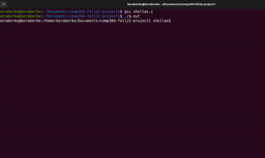

# comp304-fall22-project1


### Bora's custom command `snake`:
```
usage: snake [-h] [--speed {1,2,3,4,5,6,7,8,9,10}]
             [--frame {small,medium,large}]

A simple and fun classic snake game!

optional arguments:
  -h, --help            show this help message and exit
  --speed {1,2,3,4,5,6,7,8,9,10}
                        the speed of the game. Between 1 and 10
  --frame {small,medium,large}
                        Size of the frame. small, medium, or big.
```

